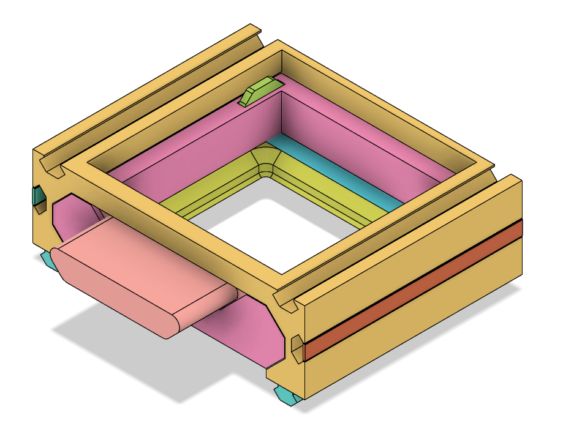
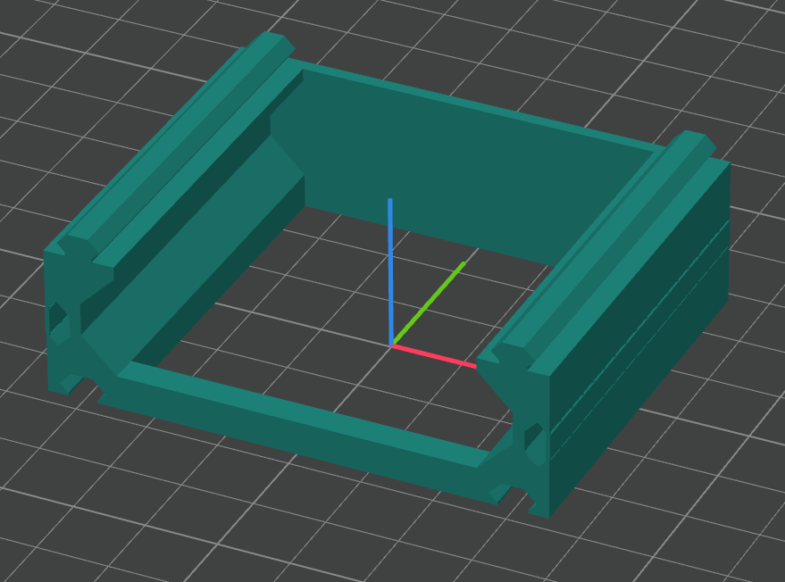
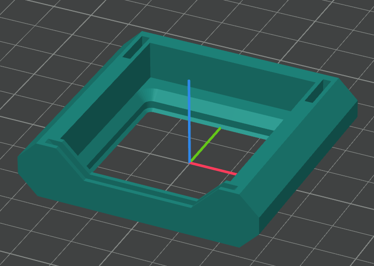
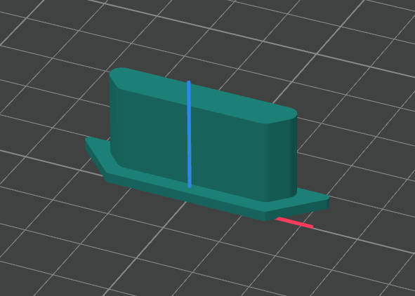
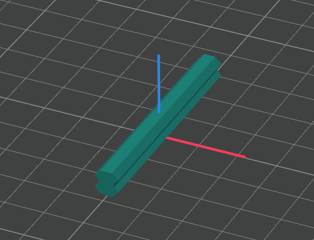
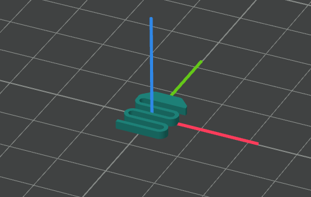

# gridfinity-drawer

This repository contains Fusion 360 source and export-ready models for modular, parametric drawers designed to be compatible with Gridfinity-style systems. The Fusion 360 design is organized so you can adjust key parameters to match your Gridfinity grid and print custom drawer sizes that snap into Gridfinity modules.

**What this file is**: A Fusion 360 design containing a family of parametric drawer modules (drawers, dividers, lids, mounting plates) that can be resized and exported for 3D printing.

*sample of 1 unit drawer*

**Key Features**
- **Modular:** Drawers can be joined together or stacked.
- **Parametric:** All main dimensions exposed as parameters so you can tune sizes (width, height, depth, wall thickness).
- **Printable:** Geometries designed for easy printing with optional snapping features and simple assembly.
- **Export-ready:** Pre-configured Fusion bodies and named components for easy STL export.

**How to use the Fusion 360 file**
- **Open the design:** Load the Fusion 360 file into Fusion 360.
- **Edit parameters:** Open the `Change Parameters` dialog and adjust the following parameters to match your Gridfinity system and desired drawer sizes (see next section).
- **Recompute & verify:** Regenerate the model and inspect joint fits and clearances.
- **Export STLs:** Right-click the desired component(s) and choose `Save as STL` or use the `Make`/`3D Print` workflow.

**Parametric controls**

For simplicity this design exposes three primary parameters in Fusion 360's `Change Parameters` dialog:

- `drawer_x_unit`: units in the X (width) direction.
- `drawer_y_unit`: units in the Y (depth) direction.
- `drawer_z_unit`: units in the Z (height) direction.

Notes:
- **Defaults:** `drawer_x_unit = 1`, `drawer_y_unit = 1`, `drawer_z_unit = 1` (adjust as needed).
- **Units & usage:** Values are specified as module counts; the design converts these to millimeters internally. Open `Modify -> Change Parameters`, set the three parameters, then regenerate the model and export the desired component.

**Recommended workflow for creating a drawer**

Follow this quick workflow to make and print a drawer:

- Adjust the three parameters in `Modify -> Change Parameters` to set `drawer_x_unit`, `drawer_y_unit`, and `drawer_z_unit`.
- Select the desired `Component` in the Fusion 360 browser (the drawer body or accessory you want).
- Export the selected component to STL: right-click the component -> `Save as STL` (or use `File -> 3D Print`), ensure units are `mm` and choose binary or ASCII as needed.
- Slice the exported STL and print with your printer settings.

**Printing & slicing guidance**
- **Orientation:** See pictures below.
- **Layer height:** 0.2.
- **Wall/perimeters:** 2–3 perimeters for strength.
- **Infill:** 10–25% for general use.
- **Bridging:** If the design has internal bridges, ensure your slicer settings handle short bridges well.
- **Test print:** Always print a small tolerance test (single-module connector and mating slot) before committing to many copies.

**Assembly & finishing**
- Clean up any small print artifacts with light sanding or flush-cutting of support points.
- For friction slides, consider adding PTFE lubricant if sliding is stiff.

**Exporting variants**
- Components are named in the Fusion file for easy selection. Export the specific named `Component` as STL using `File -> 3D Print` with units set to `mm` and binary or ASCII as desired.

**Licensing & attribution**
- Include a clear license in this repository (e.g., `LICENSE` file). If you plan to release models derived from Gridfinity community designs, follow their attribution / license requirements.

**STL orientation**

*drawer_mount component orientation*

> Note:
>
> drawer_mount component has built-in supports, you don't need to add them into the slicer.

*drawer component orientation*

*handle component orientation*

*joint component orientation*

*spring component orientation*
